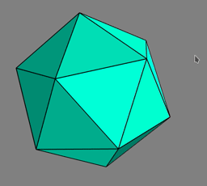

# wythoff-construct

> Constructs and visualizes hyperdimensional polytopes created using Wythoff construction
- [INSTALLATION](#INSTALLATION)
- [USAGE](#USAGE)
- [EXAMPLES](#EXAMPLES)


# INSTALLATION
``` 
pip install wythoff-construct
```
Note wythoff-construct requires python version 3.6 to 3.8. version 3.9 will be supported as soon
as vtk (a dependancy) supports 3.9.

# USAGE
Once installed using pip the following command will launch the application from any working directory
```
wythoff-construct
```  

for general information regarding Wythoff Construction see https://en.wikipedia.org/wiki/Wythoff_construction

### Seed Point Selection
Basic: Use the sliders to smoothly transition between shapes.

Advanced: These sliders select the point which is reflected in the kaleidoscope mirrors to get all
the vertices of the polytope. Each slider scales a vector pointing from one intersection of the kaleidoscope
mirrors to all other intersections (the point of intersection are between all but one of the mirrors, and
the unit sphere). They are essentially the coordinates on the spherical triangle which tile sphere (hence their sum is kept to 1).
In higher dimensions the picture is similar, except there are more mirrors and more intersections and more vectors.

### Dimension
Simply used to change the number of spatial dimensions and hence which kaleidoscopes are available
(3,4 and 5 are currently supported).

### Kaleidoscope
Basic: Determines what shapes are created using the seed point selection sliders.

Advanced: the coxeter notation for which reflection group (kaleidoscope) is active. For dimension 3 I excluded all
but one dihedral group, as to not clutter the UI (the others are very similar).

All kaleidoscopes save after the first time they are generated to allow for faster switching between them afterwards.
I also pre-generated [3²,5] and [3³,4] due to long generation times.

### Rotation
Rotation in 3 dimensions is done by clicking and dragging the mouse, In higher dimensions I included sliders for the
additional rotations not possible in 3 dimensions there will be 3ⁿ-3 sliders where n is the number of dimensions.

### Projection
Controls how the program renders n dimensional shapes in 3 dimensions (3 to 2 dimensions is handled by the ui program
which can be changed using the toggle parallel projection button on top).

Perspective: Things closer in higher dimensions appear bigger.

Orthographic: Size does not depend on distance.

For a clear example, load [3²,4], the smaller inner cube when on Perspective projection is further from you in the 4th dimension.

### Opacity
Controls how opaque the faces (2D cells) are on the polytope. automatically scales down with dimension to compete with the
growing number of faces.

# EXAMPLES
> Looks much better in person!
<p float="left">



</p>


